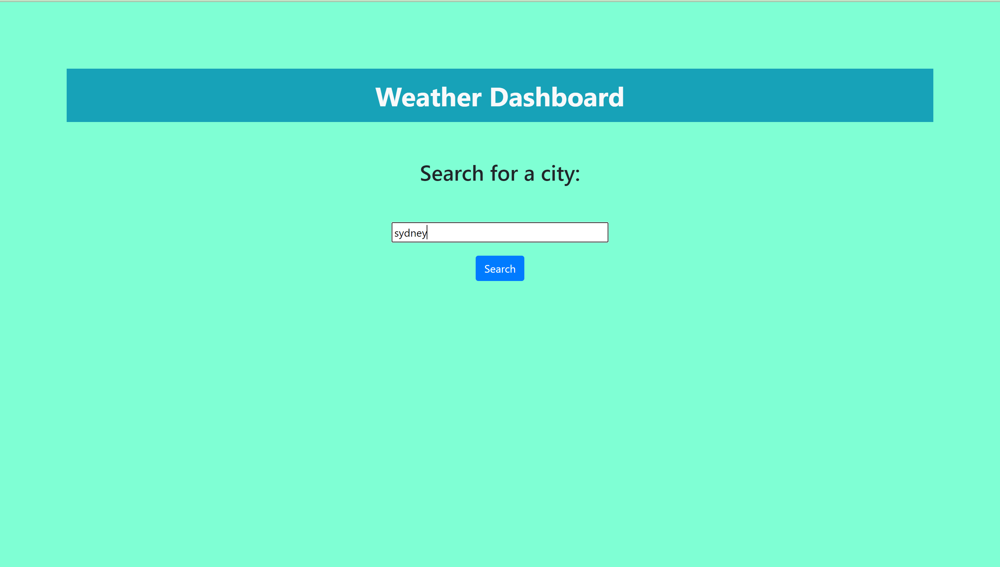
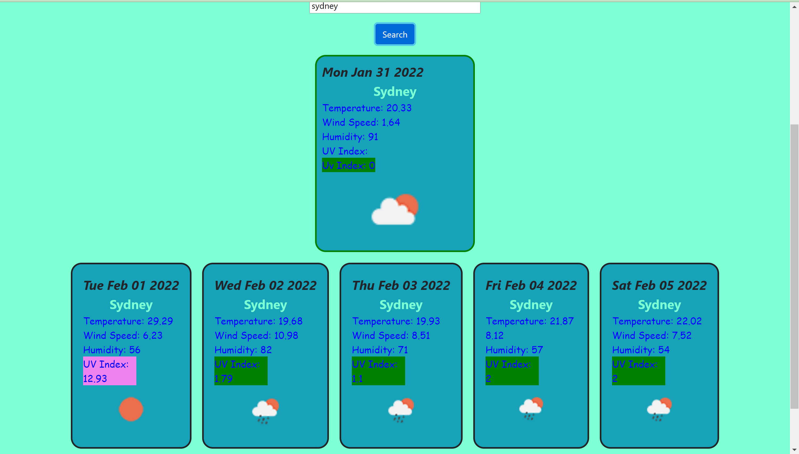
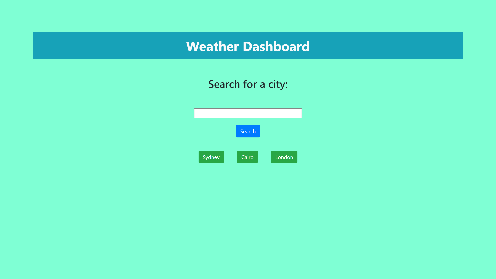

# Weather Dashboard

## Description

The website provides weather search utility that displays weather data information of the required city for current and 5 days forecast. Previously searched cities are stored and displayed for quick access. Weather icons are displayed based on the returned weather condition. UV index is displayed with color corresponding to its severity level.

## Installation

Please visit the weather dashboard at: https://monamahmoud.github.io/WeatherDashboard/ to find weather info for your favourite city.

## Usage

Type a city name into the search box like this:    

Then click the search button, weather data will appear below like this:  

Upon visiting the site again, previously searched cities will appear like this:  

To access weather data of a previoulsy searched city click on the button corresponding to its name.

